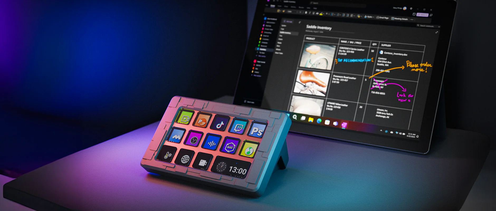
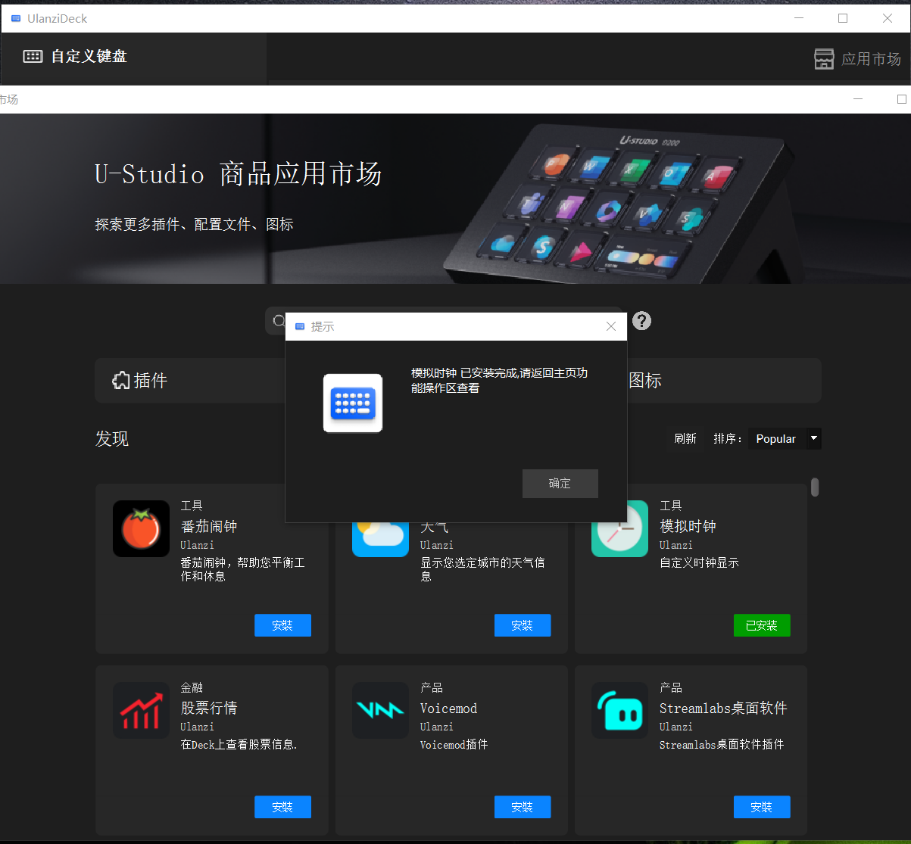
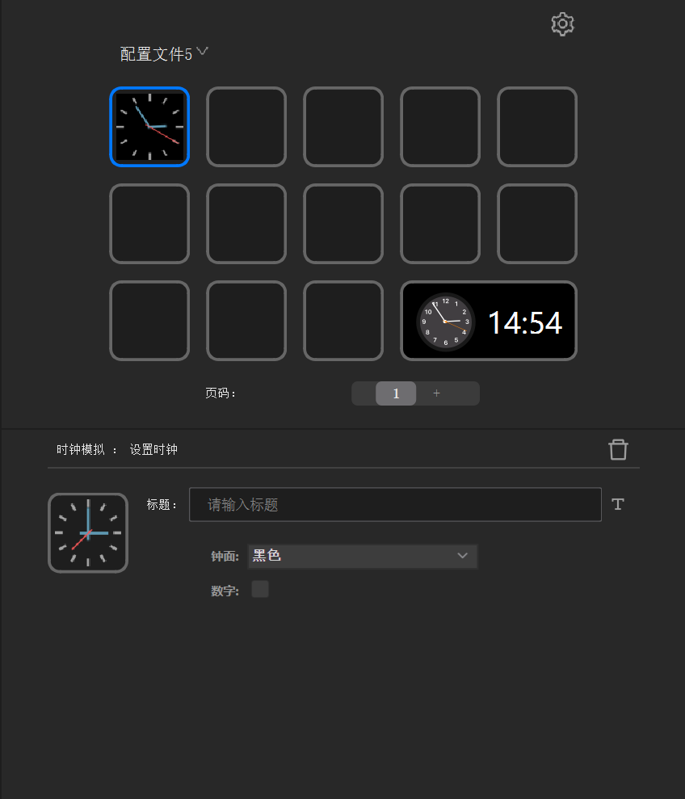

Title: Do zero: Jornada de desenvolvimento de plugins UlanziDeck - Comunidade de Desenvolvedores Tencent Cloud

URL Source: https://cloud-tencent-com.translate.goog/developer/article/2461403?_x_tr_sl=auto&_x_tr_tl=pt&_x_tr_hl=pt-BR&_x_tr_pto=wapp

Markdown Content:

Ulanzi StreamDeck

Na era digital, personalização e eficiência são essenciais. O Ulanzi Stream Deck é um teclado visual poderoso para controle de desktop que, por meio de seu sistema de plugins, oferece espaço criativo praticamente ilimitado para desenvolvedores e entusiastas. Neste artigo vamos começar do zero e explorar o processo de desenvolvimento de plugins para o Ulanzi Deck, para tornar sua experiência de controle do desktop mais personalizada e eficiente.

Preparando o ambiente
----

Antes de começar, certifique-se de ter instalado as seguintes ferramentas e ambientes:

* Node.js versão 20 ou superior.
* Ulanzi Deck (software) — baixe em: https://www.ulanzi.cn/list-xiazaizhongxin.html
* Um editor/IDE (por exemplo: VS Code, WebStorm).
* Ulanzi Deck Plugin SDK: https://github.com/UlanziTechnology/UlanziDeckPlugin-SDK

Demonstração do plugin
----

Após instalar o UlanziDeck, abra a loja de aplicativos no canto superior direito e faça o download do plugin "Analog Clock" (Relógio Analógico) para ver seu funcionamento.





Como mostrado acima, o relógio está em execução e existe uma área para ajuste de parâmetros abaixo. A seguir, vamos explorar o processo de implementação do plugin.

Implementando o plugin
----

### 1. Estrutura da pasta do plugin

O plugin instalado fica normalmente em:

`C:\Users\<usuário>\AppData\Roaming\Ulanzi\UlanziDeck\Plugins`

Nessa pasta encontramos o diretório do plugin (ex.: `com.ulanzi.analogclock.ulanziPlugin`). A estrutura típica do plugin é a seguinte:

```
com.ulanzi.analogclock.ulanziPlugin
├── assets         // ícones e imagens de estados das actions
│   └── icons      
│       └── icon.png
├── libs           // bibliotecas comuns do plugin (ver Ulanzi Deck Plugin SDK)
├── plugin         // módulos JS principais (lógica das actions)
│   ├── actions    // lógica das actions
│   ├── app.html   // página principal (serviço principal)
│   └── app.js     // script do serviço principal
├── property-inspector // páginas de configuração e formulários
│   └── clock      // nome da action
│       ├── inspector.html  // HTML do inspector
│       └── inspector.js    // JS do inspector (socket/form)
├── manifest.json  // definição do plugin
├── zh_CN.json     // tradução para chinês (original)
├── en.json        // tradução para inglês
```

Manifest.json: entenda a configuração do plugin
----

Vamos analisar o arquivo `manifest.json` do plugin (exemplo):

manifest.json
```json
{
    "Version": "1.0.4",
    "Author": "Ulanzi",
    "Name": "Analog Clock",
    "Description": "Always be on time.",
    "Icon": "assets/icons/icon.png",
    "Category": "Analog Clock",
    "CategoryIcon": "assets/icons/categoryIcon.png",
    "CodePath": "plugin/app.html", 
    "Type": "JavaScript",
    "SupportedInMultiActions": false,
    "PrivateAPI": true,
    "UUID": "com.ulanzi.ulanzideck.analogclock",
    "Actions": [
      {
        "Name": "clock",
        "Icon": "assets/icons/actionIcon.png",
        "PropertyInspectorPath": "property-inspector/clock/inspector.html",
        "state": 0,
        "States": [
          {
            "Name": "clock",
            "Image": "assets/icons/icon.png"
          }
        ],
        "Tooltip": "Show a nice analog clock",
        "UUID": "com.ulanzi.ulanzideck.analogclock.clock",
        "SupportedInMultiActions": false
      }
    ],
    "OS": [
      {
        "Platform": "mac",
        "MinimumVersion": "10.11"
      },
      {
        "Platform": "windows",
        "MinimumVersion": "10"
      }
    ],
    "Software": {
      "MinimumVersion": "6.1"
    }
  }
```

Icon / Name

O ícone e o nome do plugin exibidos na lista à esquerda do software.

Category / CategoryIcon / Author / Description / Version

Esses itens aparecem na área direita da tela em Settings -> Plugins: nome, ícone, autor, descrição e versão.

CodePath

`CodePath` aponta para o programa principal do plugin, que pode ser um arquivo `.html` ou `.js`.
- Se for `.html`, o host carrega por QWebEngineView.
- Se for `.js`, o host executa via Node (versão compatível indicada no manifesto).

UUID

UUID identifica unicamente o serviço principal do plugin.

Actions -> Name / Icon

Cada action (configuração) possui nome e ícone que aparecem quando o plugin é expandido na lista.

Actions -> PropertyInspectorPath

`PropertyInspectorPath` aponta para a página HTML de configuração da action; o host a carrega na área inferior para permitir ajuste de parâmetros.

Actions -> UUID

UUID de cada action — identifica exclusivamente cada configuração.

Actions -> SupportedInMultiActions

Indica se a action funciona em modo multi-action (arrastar várias ações em um slot).

Actions -> States / state

Define os ícones usados para os estados de um botão. O índice `state` refere-se à posição no array `States`. No caso do relógio analógico, o ícone do botão é atualizado dinamicamente, então o ícone padrão pode não aparecer.

Convenções gerais

- Nome do pacote do plugin: `com.ulanzi.<pluginName>.ulanziPlugin`.
- UUID do serviço principal tem comprimento 4, por exemplo: `com.ulanzi.ulanzideck.<pluginName>`.
- UUID das actions tem comprimento maior que 4, por exemplo: `com.ulanzi.ulanzideck.<pluginName>.<action>`.
- A fonte padrão usada na UI é Source Han Sans (思源黑体) — o CSS comum (`udpi.css`) já a referencia.
- A cor de fundo do host é `#282828`; recomenda-se usar tons similares para evitar contraste forte.

Plugin principal, Action e PropertyInspector — como são carregados
----

Plugin principal

O host carrega o `CodePath` do manifesto como o programa principal do plugin. Esse programa deve se conectar ao host via WebSocket (ws) e manter comunicação durante seu ciclo de vida (desde o início do host até o encerramento ou até a desinstalação do plugin).

Quando carregado via Node (app.js), o host passa os parâmetros de endereço e porta do servidor WebSocket:

Exemplo (PowerShell):

`node.exe "app.js" "127.0.0.1" "3906" "en-US"`

Quando carregado via HTML (app.html), parâmetros são adicionados à URL como pares chave/valor:

```
app.html?address=127.0.0.1          // endereço do servidor ws
                &port=3906          // porta do servidor ws     
                &language=en-US
                &uuid="com.xxx.xxx" // UUID do serviço principal
```

Action / PropertyInspector

Ao arrastar a action (por exemplo, o relógio) para um botão, o host carrega o `PropertyInspectorPath` na área inferior. O `PropertyInspector` existe enquanto a área estiver visível.

```
PropertyInspector.html?address=127.0.0.1    // endereço do servidor ws
                &port=3906                 // porta do servidor ws    
                &language=en-US
                &uuid="com.xxx.xxx" // UUID da action
                &actionId="" // ID único da action
                &key="0_0"   // coordenada do botão (linha_coluna)
```

Comunicação entre servidor, plugin principal e Action
----

Eventos do servidor

Na documentação do SDK (UlanziDeck Plugin SDK) vemos que, ao implementar `app.html/js` e `propertyInspector.html`, o primeiro passo é conectar-se ao servidor: `$UD.connect(UUID)`. Em seguida, o plugin escuta eventos do servidor e implementa suas funcionalidades com base neles.

Plugin — solicitações para o servidor

O plugin pode enviar diversas requisições ao servidor (ex.: atualizar parâmetros, solicitar execução etc.).

Comunicação app.html/js <=> PropertyInspector.html

Abaixo explicamos como o app e o propertyInspector trocam mensagens. Quando o usuário altera a opção "número" no inspector, o inspector envia os parâmetros ao servidor usando `sendParamFromPlugin`. O servidor então encaminha essa atualização de parâmetros para o app (serviço principal) e vice-versa, de forma que ambos fiquem sincronizados.

Exemplo no `propertyInspector.js`:

```javascript
$UD.connect('com.ulanzi.ulanzideck.analogclock.clock')
$UD.onConnected(conn => {
  // obtém o formulário
  form = document.querySelector('#property-inspector');

  // renderiza as opções
  const oClockSelector = document.querySelector(".clockSelector");
  Object.keys(clockfaces).map(e => {
    let option = document.createElement('option');
    option.setAttribute('value', e);
    option.setAttribute('label', clockfaces[e].name);
    option.setAttribute('data-localize', clockfaces[e].name);
    oClockSelector.appendChild(option);
  });

  // conecta ao socket e mostra o inspector
  const el = document.querySelector('.udpi-wrapper');
  el.classList.remove('hidden');

  // ouve mudanças no formulário e envia parâmetros ao host
  form.addEventListener(
    'input',
    Utils.debounce(() => {
        const value = Utils.getFormValue(form);
        ACTION_SETTING = value
        if(!ACTION_SETTING.clock_type) ACTION_SETTING.clock_type = 'analog'
        $UD.sendParamFromPlugin(ACTION_SETTING);   // envia atualização de parâmetros
    })
  );
});
```

No `app.js`, ao receber a atualização de parâmetros, o app atualiza o desenho:

```javascript
$UD.onParamFromPlugin(jsn =>{
  onSetSettings(jsn)  // recebe atualização de parâmetros do propertyInspector
})

function onSetSettings(jsn){
  const settings = jsn.param ||  {}
  const context = jsn.context   // context contém o UUID da action
  const clock = ACTION_CACHES[context];  // encontra a instância do action
  if(!settings || !clock) return;

  if(settings.hasOwnProperty('clock_index')) { 
      const clockIdx = Number(settings.clock_index);
      clock.setClockFaceNum(clockIdx);
      ACTION_CACHES[context] = clock;
  }
  if(settings.hasOwnProperty('clock_type')) {
    clock.setClockType(settings.clock_type); // atualiza o parâmetro "tipo" no instance
  }
}
```

Estado ativo (active) das Actions
----

O servidor emite o evento `onSetActive`. Quando se troca de página, as actions não pertencentes à página ativa são marcadas como inativas; nessas ocasiões o plugin deve liberar recursos (parar timers, etc.) até receber o evento de retorno a `active`.

Exemplo:

```javascript
$UD.onSetActive(jsn =>{
  const context = jsn.context
  const instance = ACTION_CACHES[context];
  if (instance) {
    instance.setActive(jsn.active)
  }
})
```

Remoção de Actions
----

A remoção de uma action é sinalizada pelo evento `onClear`. A remoção pode ocorrer por três motivos:

1) remoção do botão
2) exclusão da página
3) exclusão da configuração

Resumo
---

Apresentamos aqui a criação de um plugin, seu carregamento e a comunicação entre servidor e plugin. Para dúvidas ou erros, entre em contato. O código completo e a documentação do SDK (com detalhes sobre a API) estão no repositório Ulanzi Deck Plugin SDK. Em um próximo artigo veremos o fluxo de depuração e uma explicação mais aprofundada sobre plugins em Node.js.
